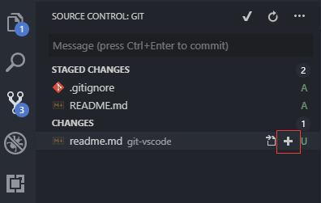

<!--
 * @Description: 
 * @Version: 
 * @Author: Henry
 * @Date: 2020-02-24 10:38:40
 * @LastEditors: Henry
 * @LastEditTime: 2020-02-28 13:18:31
 -->
 VSCode中git应用
 ==============

## 上传本地仓库至GitHub
### 创建Repository

>git init

### 保存至暂存区

git add
git add .

### 提交到工作区
git commit -m "first commit"
